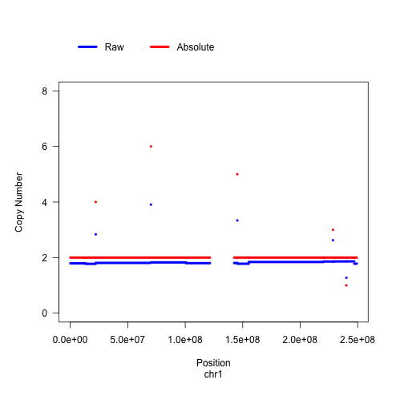

<!-- README.md is generated from README.Rmd. Please edit that file -->


# absCopyNumber: Tumor Purity, Ploidy and Absolute Copy Number Estimator

 [](https://github.com/ShixiangWang/absCopyNumber)   [](https://ci.appveyor.com/project/ShixiangWang/absCopyNumber) [](https://codecov.io/github/ShixiangWang/absCopyNumber?branch=master) [](https://github.com/ShixiangWang/absCopyNumber/issues?utf8=%E2%9C%93&q=is%3Aissue+is%3Aopen+)


The goal of absCopyNumber is to Estimate tumor purity, ploidy and absolute copy numbers from NGS (WGS, WES, Target Sequencing) and Microarray (SNP, aCGH etc.) data, based on statistical method from paper — "*AbsCN-seq: a statistical method to estimate tumor purity, ploidy and absolute copy numbers from next-generation sequencing data*".

Currently, most of code come from [absCNseq package](https://github.com/ShixiangWang/absCNseq) (not maintained), which used for NGS data. I modified some code and extend it for microarray data, like SNP array. The statistical method come from `AbsCN-seq` is very robust and easy to use, I think it can definitely handle microarray data. 

## Installation

You can install absCopyNumber from github with:


```r
# install.packages("devtools")
devtools::install_github("ShixiangWang/absCopyNumber")
```


## Example

The following I will show a basic example which shows you how to use absCopyNumber.

### Load absCopyNumber


```r
library(absCopyNumber)
```

### Run absCopyNumber from Local Files


This step should identify local path of copy ratio and snv (optional) files. Here we use example files within package.


```r
example_cn = system.file("extdata", "example.cn.txt.gz", package = "absCopyNumber")
example_snv = system.file("extdata", "example.snv.txt.gz", package = "absCopyNumber")
```


Bacause R can handle zipped files, so gzipped file is okay here. Of note, the input copy number file and somatic mutation file should following some rules:

```
1. Input copy ratio file ("example.cn.txt")

The input copy ratio file contains segmented copy ratio data, which can be generated by popular segmentation algorithms like 
the "DNAcopy" R package.
It should be a tab-delimited text file with five columns.  
Please use the EXACT header names as below.
1) "chrom"
The chromosome number of a segment. Must be a integer number from 1 to 22.
2) "loc.start"
The start position of a segment.
3) "loc.end"
The end position of a segment.
4) "eff.seg.len"
For exome sequencing, due to the nature of highly uneven coverage (zero coverage for introns), this column gives the number of base pairs with actual observed coverage. 
It can be derived by concatenate all the VARSCAN bins within a segment. 
Note that this length is usually much smaller than the length of the segment which is loc.end-loc.start+1	
5) "normalized.ratio"
The mean copy ratio (tumor DNA vs. germline DNA) of a segment. 
Note that the copy ratio should be normalized to eliminate any sequencing throughput difference between tumor and germline DNA. 
For example, samtools can be used to count total reads that were properly paired/aligned for tumor and germline DNA. 
The difference then need to be adjusted accordingly.  


2. Input SNV file ("example.snv.txt")

The input SNV file contains allele frequency data for somatic mutations.
It should be a tab-delimited text file with three columns.
Please use the EXACT header names as below.
1) "chrom"
The chromosome number of a somatic SNV. Must be a integer number from 1 to 22.
2) "position"
The genomic position of a somatic SNV.
3) "tumor_var_freq"
The proportion of reads supporting the somatic SNV allele. Must be a fraction number. 
```

The example data come from WES platform, next we specify parameter to run absCopyNumber. We use `run_fromLocal()` function to process data specified as file path.


```r
my.res.list <- run_fromLocal(seg.fn = example_cn, snv.fn = example_snv, platform="WES", min.seg.len=200, verbose = TRUE)
#> min.seg.len= 200 
#> qmax= 7 
#> lamda= 0.5 
#> retained and all segments 261 319 
#> 0.003831418 segments with r>3.0 before rescaling
#> 0.01915709 segments with r<0.33 before rescaling
#> # of SNVs used: 59 
#> 12345678910111213141516171819202122232425262728293031323334353637383940414243444546474849505152535455565758596061626364656667686970717273747576777879808182838485868788899091929394959697989910010110210310410510610710810911011111211311411511611711811912012112212312412512612712812913013113213313413513613713813914014114214314414514614714814915015115215315415515615715815916016116216316416516616716816917017117217317417517617717817918018118218318418518618718818919019119219319419519619719819920020120220320420520620720820921021121221321421521621721821922022122222322422522622722822923023123223323423523623723823924024124224324424524624724824925025125225325425525625725825926026126226326426526626726826927027127227327427527627727827928028128228328428528628728828929029129229329429529629729829930030130230330430530630730830931031131231331431531631731831932032132232332432532632732832933033133233333433533633733833934034134234334434534634734834935035135235335435535635735835936036136236336436536636736836937037137237337437537637737837938038138238338438538638738838939039139239339439539639739839940040140240340440540640740840941041141241341441541641741841942042142242342442542642742842943043143243343443543643743843944044144244344444544644744844945045145245345445545645745845946046146246346446546646746846947047147247347447547647747847948048148248348448548648748848949049149249349449549649749849950050150250350450550650750850951051151251351451551651751851952052152252352452552652752852953053153253353453553653753853954054154254354454554654754854955055155255355455555655755855956056156256356456556656756856957057157257357457557657757857958058158258358458558658758858959059159259359459559659759859960060160260360460560660760860961061161261361461561661761861962062162262362462562662762862963063163263363463563663763863964064164264364464564664764864965065165265365465565665765865966066166266366466566666766866967067167267367467567667767867968068168268368468568668768868969069169269369469569669769869970070170270370470570670770870971071171271371471571671771871972072172272372472572672772872973073173273373473573673773873974074174274374474574674774874975075175275375475575675775875976076176276376476576676776876977077177277377477577677777877978078178278378478578678778878979079179279379479579679779879980080180280380480580680780880981081181281381481581681781881982082182282382482582682782882983083183283383483583683783883984084184284384484584684784884985085185285385485585685785885986086186286386486586686786886987087187287387487587687787887988088188288388488588688788888989089189289389489589689789889990090190290390490590690790890991091191291391491591691791891992092192292392492592692792892993093193293393493593693793893994094194294394494594694794894995095195295395495595695795895996096196296396496596696796896997097197297397497597697797897998098198298398498598698798898999099199299399499599699799899910001001100210031004100510061007100810091010101110121013101410151016101710181019102010211022102310241025102610271028102910301031103210331034103510361037103810391040104110421043104410451046104710481049105010511052105310541055105610571058105910601061106210631064106510661067106810691070107110721073107410751076107710781079108010811082108310841085108610871088108910901091109210931094109510961097109810991100110111021103110411051106110711081109111011111112111311141115111611171118111911201121112211231124112511261127112811291130113111321133113411351136113711381139114011411142114311441145114611471148114911501151115211531154115511561157115811591160116111621163116411651166116711681169117011711172117311741175117611771178117911801181118211831184118511861187118811891190119111921193119411951196119711981199120012011202120312041205120612071208120912101211121212131214121512161217121812191220122112221223122412251226122712281229123012311232123312341235123612371238123912401241124212431244124512461247124812491250125112521253125412551256125712581259126012611262126312641265126612671268126912701271127212731274127512761277127812791280128112821283128412851286128712881289129012911292129312941295129612971298129913001301130213031304130513061307130813091310131113121313131413151316131713181319132013211322132313241325132613271328132913301331133213331334133513361337133813391340134113421343134413451346134713481349135013511352135313541355135613571358135913601361136213631364136513661367136813691370137113721373137413751376137713781379138013811382138313841385138613871388138913901391139213931394139513961397139813991400140114021403140414051406140714081409141014111412141314141415141614171418141914201421142214231424142514261427142814291430143114321433143414351436143714381439144014411442144314441445144614471448144914501451145214531454145514561457145814591460146114621463146414651466146714681469147014711472147314741475147614771478147914801481148214831484148514861487148814891490149114921493149414951496149714981499150015011502150315041505150615071508150915101511151215131514151515161517151815191520152115221523152415251526152715281529153015311532153315341535153615371538153915401541154215431544154515461547154815491550155115521553155415551556155715581559156015611562156315641565156615671568156915701571157215731574157515761577157815791580158115821583158415851586158715881589159015911592159315941595159615971598159916001601160216031604160516061607160816091610161116121613161416151616161716181619162016211622162316241625162616271628162916301631163216331634163516361637163816391640164116421643164416451646164716481649165016511652165316541655165616571658165916601661166216631664166516661667166816691670167116721673167416751676167716781679168016811682168316841685168616871688168916901691169216931694169516961697169816991700170117021703170417051706170717081709171017111712171317141715171617171718171917201721172217231724172517261727172817291730173117321733173417351736173717381739174017411742174317441745174617471748174917501751175217531754175517561757175817591760176117621763176417651766176717681769177017711772177317741775177617771778177917801781178217831784178517861787178817891790179117921793179417951796179717981799180018011802180318041805180618071808180918101811181218131814181518161817181818191820182118221823182418251826182718281829183018311832183318341835183618371838183918401841184218431844184518461847184818491850185118521853185418551856185718581859186018611862186318641865186618671868186918701871187218731874187518761877187818791880188118821883188418851886188718881889189018911892189318941895189618971898189919001901190219031904190519061907190819091910191119121913191419151916191719181919192019211922192319241925192619271928192919301931193219331934193519361937193819391940194119421943194419451946194719481949195019511952195319541955195619571958195919601961196219631964196519661967196819691970197119721973197419751976197719781979198019811982198319841985198619871988198919901991199219931994199519961997199819992000200120022003200420052006200720082009201020112012201320142015201620172018201920202021202220232024202520262027202820292030203120322033203420352036203720382039204020412042204320442045204620472048204920502051205220532054205520562057205820592060206120622063206420652066206720682069207020712072207320742075207620772078207920802081208220832084208520862087208820892090209120922093209420952096209720982099210021012102210321042105210621072108210921102111211221132114211521162117211821192120212121222123212421252126212721282129213021312132213321342135213621372138213921402141214221432144214521462147214821492150215121522153215421552156215721582159216021612162216321642165216621672168216921702171217221732174217521762177217821792180218121822183218421852186218721882189219021912192219321942195219621972198219922002201220222032204220522062207220822092210221122122213221422152216221722182219222022212222222322242225222622272228222922302231223222332234223522362237223822392240224122422243224422452246224722482249225022512252225322542255225622572258225922602261226222632264226522662267226822692270227122722273227422752276227722782279228022812282228322842285228622872288228922902291229222932294229522962297229822992300230123022303230423052306230723082309231023112312231323142315231623172318231923202321232223232324232523262327232823292330233123322333233423352336233723382339234023412342234323442345234623472348234923502351235223532354235523562357235823592360236123622363236423652366236723682369237023712372237323742375237623772378237923802381238223832384238523862387238823892390239123922393239423952396239723982399240024012402240324042405240624072408240924102411241224132414241524162417241824192420242124222423242424252426242724282429243024312432243324342435243624372438243924402441244224432444244524462447244824492450245124522453245424552456245724582459246024612462246324642465246624672468246924702471247224732474247524762477247824792480248124822483248424852486248724882489249024912492249324942495249624972498249925002501250225032504250525062507250825092510251125122513251425152516251725182519252025212522252325242525252625272528252925302531253225332534253525362537253825392540254125422543254425452546254725482549255025512552255325542555255625572558255925602561256225632564256525662567
#> [1] 2556 2556
#> 18 unique results
```

The result is a `list` contains all solutions and other orignal and model information. Solution result is a data.frame named `searchRes` in list. 


```r
knitr::kable(my.res.list$searchRes, align = 'c', caption = "Solution Data.Frame")
```


| alpha | tau  | tau.def |    mse    | count |
|:-----:|:----:|:-------:|:---------:|:-----:|
| 0.56  | 2.18 |  2.18   | 0.0034775 |  376  |
| 0.86  | 3.18 |  3.18   | 0.0045713 |  385  |
| 0.45  | 1.18 |  1.18   | 0.0047756 |  369  |
| 1.00  | 4.17 |  4.17   | 0.0072484 |  471  |
| 1.00  | 5.12 |  5.12   | 0.0106136 |  865  |

Generally we use top 1 solution, so the corresponding result has been stored at `absCN` data.frame of `my.res.list`. We can also mannually select best solution using our own knowledge. After selecting solution, we calculate absolute copy number by `get_absCopyNumber` function based on purity $\alpha$ and ploidy $\tau$.


```r
# select i-th solution
i = 1
seg.CN <- get_absCopyNumber(my.res.list$seg.dat, my.res.list$searchRes[i,"alpha"], my.res.list$searchRes[i,"tau"])  
```

Last, we plot orignal copy number (Raw) and absolute copy number (Absolute) on a same figure.


```r
plot_absCopyNumber(seg.CN, chromnum=1)
```



### Run absCopyNumber from data.frame

Sometimes, we process data in R console, so absCopyNumber provide function `run_fromDF` to substitute `run_fromLocal`. Similar arguments and procedure as above, thus we do not show details here.


```r
cn_df = read.table(example_cn, sep = "\t", header = TRUE,  stringsAsFactors = FALSE)
snv_df = read.table(example_snv, sep = "\t", header = TRUE, stringsAsFactors = FALSE)
```

Run.


```r
my.res.list2 = run_fromDF(seg.df = cn_df, snv.df = snv_df, platform = "WES", min.seg.len=200)

identical(my.res.list, my.res.list2)
#> [1] TRUE
```

